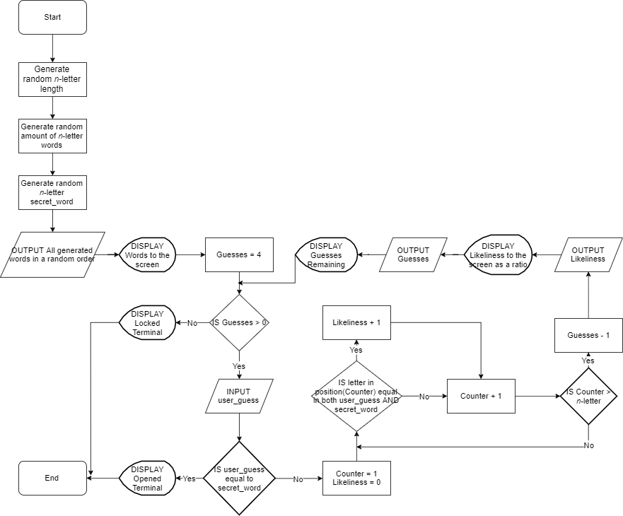

# COMP110 Worksheet 3: Flowcharts and pseudocode

This is the base repository for COMP110 Worksheet 3.

Fork this repository, and edit `README.md` to show your pseudocode solving the worksheet task. Tip: use triple backticks to preserve spacing, e.g.:

My flowchart:



```
BEGIN

READ words, guesses, total_letters, won FROM game

SELECT a word at random from words
guess = word

WHILE guesses > 0 AND won == false DO

	INPUT guess
	
	READ likeliness, won, guesses FROM game
	
	IF guess has likeliness >= (25% of total_letters) THEN

		FOR possibleAnswer in words DO

			currentLikeliness = 0

			FOR iteration in total_letters DO
				IF guess[iteration] == possibleAnswer[iteration] THEN
					currentLikeliness + 1
				ENDIF
			ENDDO

			IF currentLikeliness > highestLikeliness THEN
				guess = possibleAnswer
				highestLikeliness = currentLikeliness
			ENDIF

		ENDDO

	ELSE
		SELECT a word at random from words
		guess = word
	ENDIF

ENDDO

END
```
