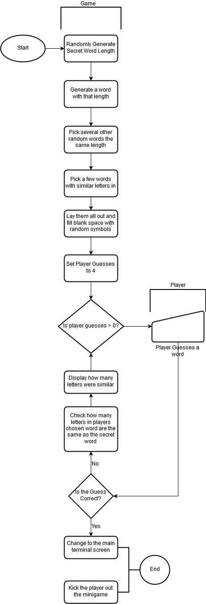

# COMP110 Worksheet 3: Flowcharts and pseudocode

This is the base repository for COMP110 Worksheet 3.

Fork this repository, and edit `README.md` to show your pseudocode solving the worksheet task. Tip: use triple backticks to preserve spacing, e.g.:

```
Number of guesses = 4
List of possible words
correct word
numberofsimilarletters = 0
lastselectedsimilar = 0
running = true

   While running
      select random word from list of possible words
      number of similar letters = letters that are the same in random word and correct word
      
      if numberofsimilarletters = 0
         select a completely new word
         set lastselectedsimilar
         
      if numberofsimilarletters >= 1
         select a word that would have one or more matching number
         set lastselectedsimilar
         
      if numberofsimilarletters > lastselectedsimilar
         select a word that has the same amount of similar letters
         set lastselectedsimilar
         
      if selected word = correct word
         running = false
         
```


