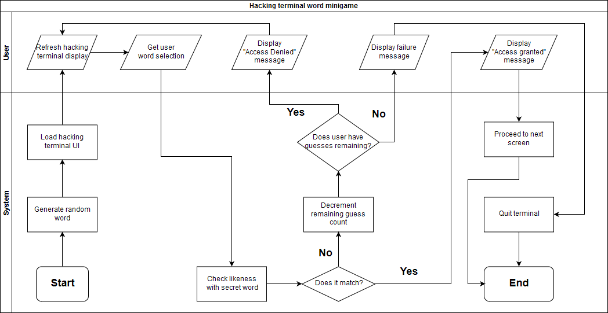

# COMP110 Worksheet 3: Flowcharts and pseudocode



```
START

correct answer = false
guesses = 4

WHILE correct answer is false DO
	Pick word from n-letter long word list
	IF picked word == the winning word DO
		correct = true
		ENDIF
	ELSE DO
		guesses - 1
		IF guesses == 0 THEN
			OUTPUT "Game over"
			ENDIF
			

END
```
