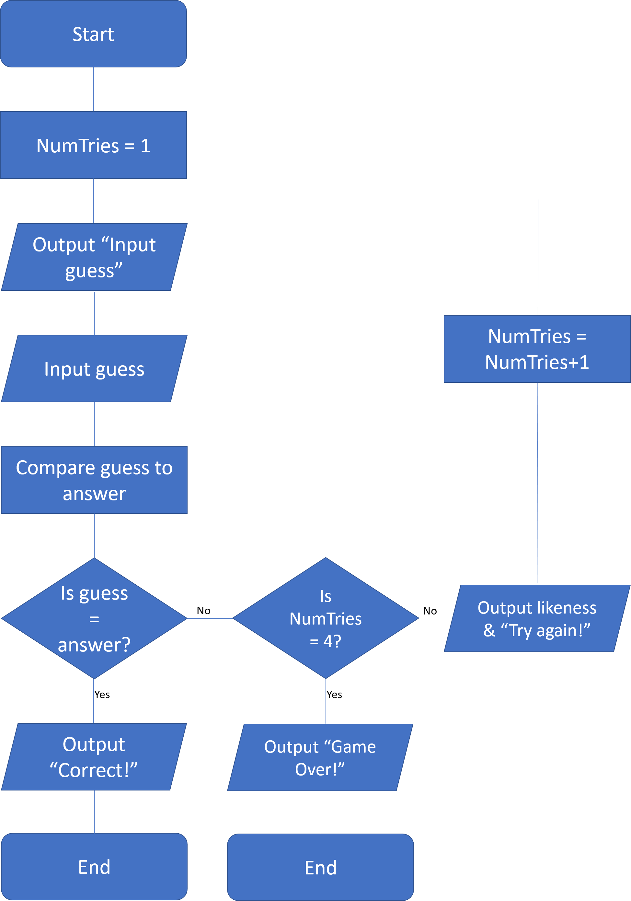

# COMP110 Worksheet 3: Flowcharts and pseudocode

This is the base repository for COMP110 Worksheet 3.

Fork this repository, and edit `README.md` to show your pseudocode solving the worksheet task. Tip: use triple backticks to preserve spacing, e.g.:

```
begin

guessed <- false
guesses <- 0


Read word_list

While guessed == false and guesses < 4

  input word

  if word == solution or latest_possible_solution_with_max_likeness == solution then
     guessed <- true
     guesses ++
 
  else
     if likeness == 0 then
        guesses ++
     
     else        
          if guesses == 0 then
              latest_possible_solution_with_max_likeness <- word
              guesses ++
         
       
     if likeness > likeness_of_latest_possible_solution then
                latest_possible_solution_with_max_likeness <- word
                guesses ++
     else
        guesses ++

if guessed == true and guesses < 4 then
   output "You win."
else
   output "You lost."
   
                  
end

```


