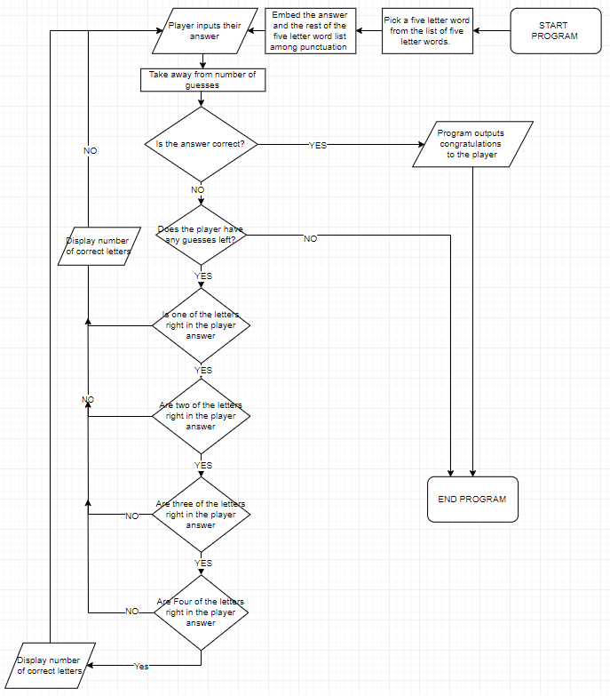

# COMP110 Worksheet 3: Flowcharts and pseudocode

This is the base repository for COMP110 Worksheet 3.

Fork this repository, and edit `README.md` to show your pseudocode solving the worksheet task. Tip: use triple backticks to preserve spacing, e.g.:

```
attempts = 4
randomly generate answer

start terminal:
	select word from terminal
	if word == answer:
		goto hackSuccessful
	else:
		wrongAnswer:
			attempts - 1
			if attemts == 0:
				goto hackFailed
			else:
				print("likeness")
				answer /= previous words
				select word where letters in the same placement == likeness
				if word == answer:
					goto hackSuccessful
				else:
					goto wrongAnswer
	
	
	hackSuccessful:
	print("The terminal has been successfully hacked!")
	End
hackFailed: 
	attempts == 0
	print("Terminal hack failed!")
```
