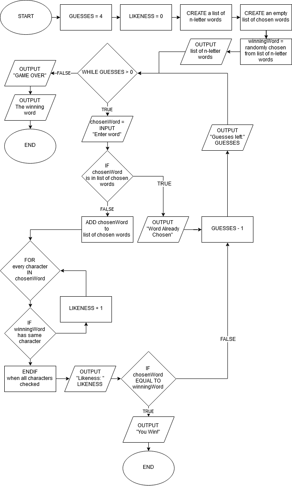

#comp110-worksheet-B
Base repository for COMP110 worksheet B

Open terminal

guesses <- 4

Victory <- 0

while guesses are above 0 and victory is 0 do

   player chooses word
	
   guesses decrease by 1
	
   terminal checks whether word is right
   
   if word is right
      victory equals 1
      
   if not
      show likeness (letters in the correct spot)
      Player needs to compare words that has been choosen with the others and choose word with highest likeness 

if victory is 1
   print "You Win"
else if victory is 0 and guesses is 0
   print "you Lose"
	
	

